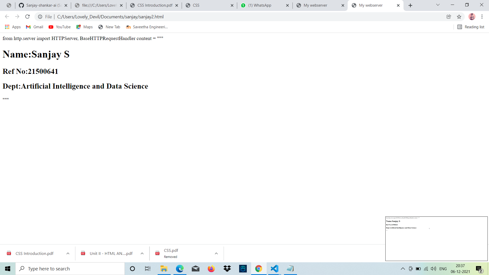

# Developing a Simple Webserver
## AIM:

To develop a simple webserver to serve html pages.
## DESIGN STEPS:
### Step 1:

HTML content creation
### Step 2:

Design of webserver workflow
### Step 3:

Implementation using Python code
### Step 4:

Serving the HTML pages.
### Step 5:

Testing the webserver
## PROGRAM:
```
from http.server import HTTPServer, BaseHTTPRequestHandler
content = """
<!DOCTYPE html>
<html>
<head>
<title>My webserver</title>
</head>
<body>
<h1>Name:Sanjay S</h1>
<h2>Ref No:21500641</h2>
<h2>Dept:Artificial Intelligence and Data Science</h2>
</body>
</html>
"""
```
## OUTPUT:

## RESULT:
Thus my webserver has been successfully created.
